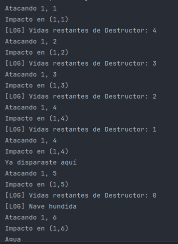

# Explicación del examen

## Demostración de como funciona el código
- Realizamos ataques a (1,1), (1,2), (1,3), (1,4), (1,5) y (1,6). En estas posiciones se encuenta el portaaviones, menos en la 1,6.
- Podemos observar que cada vez que le damos le resta una vida a la nave.
- Al volver a atacar la coordenada (1,4) ya nos avisa de que disparamos anteriormente ese punto.
- Al atacar las 5 coordenadas del portaaviones nos devuelve hundido, como ha de ser.
- Al atacar la coordenada (1,6) nos da agua, como se indicó en el código.
